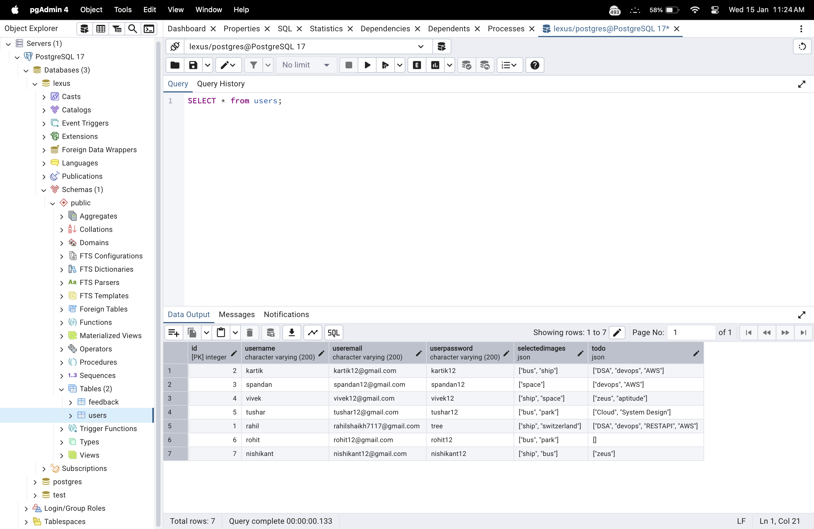

# Graphical Password Authentication and Task Management System

## Description

This project implements a **Graphical Password Authentication** system combined with a **Task Management System (To-Do List)**, developed using **Flask** and **PostgreSQL**. The system allows users to securely authenticate via graphical images, create tasks, and manage their to-do lists. This application ensures a seamless user experience with a focus on security and task organization.

## Features

- **Graphical Password Authentication**: Users authenticate by selecting a set of images they’ve previously chosen during sign-up.
- **To-Do List**: Users can manage tasks, add new ones, and delete existing ones from their personal to-do list.
- **PostgreSQL Integration**: The app uses PostgreSQL as the database backend to store user credentials, selected images for authentication, and task lists.

## Prerequisites

Before running the application, ensure that you have the following installed:

- **Python 3.x**: The application is developed in Python.
- **PostgreSQL**: The database backend for storing user information and tasks.
- **Flask**: The web framework used to build the app.
- **Flask-SQLAlchemy**: For ORM-based database interaction.

You can install the necessary Python dependencies using `pip`:

```bash
pip install -r requirements.txt
```

**Requirements.txt**

```txt
Flask==2.0.2
Flask-SQLAlchemy==2.5.1
psycopg2==2.9.1
```

## Database Setup

This application uses **PostgreSQL** as the database. Follow the steps below to set it up:

1. **Install PostgreSQL**: If you don't have PostgreSQL installed, download and install it from [PostgreSQL official website](https://www.postgresql.org/download/).

2. **Create a Database**: Create a database for this project (e.g., `lexus`).

    ```bash
    psql -U postgres
    CREATE DATABASE lexus;
    ```

3. **Update Database URI**: Update the database URI in `app.py`:

    ```python
    app.config['SQLALCHEMY_DATABASE_URI'] = "postgresql://postgres:<your-password>@localhost/lexus"
    ```

4. **Run Database Migrations**: Run the `table.py` script to create the necessary tables in the PostgreSQL database.

    ```bash
    python table.py
    ```

    This will create the required tables (`users` and any other necessary tables) in your `lexus` database.

## File Structure

The directory structure is as follows:

```
└── Rahil71-Graphical-Password-Authentication-and-Task-Management-System/
    ├── app.py                  # Main application logic
    ├── table.py                # Creates the database tables
    ├── static/
    │   ├── styles.css          # CSS styles for the web pages
    │   └── .DS_Store           # macOS specific file (can be ignored)
    └── templates/
        ├── home.html           # Home page template
        ├── login.html          # Login page template
        ├── signup.html         # Sign-up page template
        └── success.html        # Dashboard page (after successful login)
```

## Running the Application

To run the application locally, use the following steps:

1. **Set up the virtual environment** (optional but recommended):

    ```bash
    python -m venv venv
    source venv/bin/activate   # On Windows use `venv\Scripts\activate`
    ```

2. **Install dependencies**:

    ```bash
    pip install -r requirements.txt
    ```

3. **Run the application**:

    ```bash
    python app.py
    ```

    By default, the app will run on `http://127.0.0.1:5000/`.

## Routes

- `/home`: The home page where users can navigate to login or signup.
- `/login`: The login page where users can authenticate using their username, email, password, and selected images.
- `/signup`: The sign-up page where new users can create an account by choosing their username, email, password, and selecting images.
- `/success`: The dashboard where users can manage their to-do list (add/delete tasks).

## User Authentication

- During **Sign-Up**, users are asked to select a set of images that will be used for authentication.
- During **Login**, users must enter their username, email, password, and select the same images they initially selected during sign-up to authenticate.

## Screenshots

Here are some screenshots of the application:

### 1. Home Page


### 2. Login Page


### 3. Sign-Up Page


### 4. Success Page (Dashboard)


### 5. PostgreSQL Database



## Technologies Used

- **Flask**: The web framework for building the application.
- **Flask-SQLAlchemy**: The ORM used for database interaction.
- **PostgreSQL**: The relational database used to store user information and tasks.
- **HTML/CSS**: For the front-end design of the web pages.

## Contribution

Feel free to fork the repository and submit pull requests. If you find any bugs or issues, please open an issue so that it can be addressed.

## License

This project is open-source and available under the MIT License. See the [LICENSE](LICENSE) file for more details.